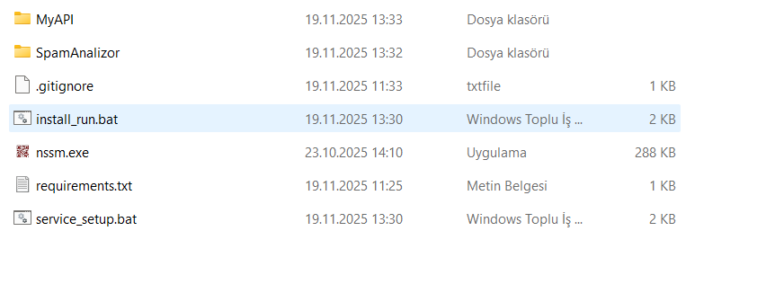

# MailEnable AI Spam Filter


## Proje Hakkında

**MailEnable AI Spam Filter**, Windows üzerindeki MailEnable sunucuları için **Mert Seçme** tarafından geliştirilmiş, yapay zeka destekli gerçek zamanlı bir spam koruma ajanıdır. Geleneksel kural tabanlı filtrelerin aksine, bu projede Türkçe e-postaların içeriğinin analiz edilmesi için **Makine Öğrenmesi (Machine Learning)** ve **Doğal Dil İşleme (NLP)** teknikleri kullanılmıştır.

Proje, mevcut spam filtrelerinin Türkçe içeriklerdeki yetersizliğini gidermek ve sunucu güvenliğini **otonom** hale getirmek amacıyla tasarlanmıştır.

### Temel Özellikler
* **Gerçek Zamanlı İzleme:** **Watchdog** altyapısı kullanılarak sunucuya düşen .MAI dosyaları anlık olarak tespit edilmektedir.
* **Yapay Zeka Destekli:** Özel olarak eğitilmiş veri seti ve algoritmalar ile **Spam Tespiti** sağlanmaktadır.
  > *🧠 Modelin nasıl eğitildiğini ve veri setini incelemek için:* [TrainAIForSpamAnalyzer](https://github.com/Meraini/TrainAIForSpamAnalyzer)
* **Türkçe NLP Desteği:** Türkçe kelime köklerinin morfolojik analizi için **Zemberek (Java)** kütüphanesi sisteme entegre edilmiştir.
* **Otomatik Yönetici İzni:** Sistem, dosya taşıma/silme işlemlerini gerçekleştirebilmek için otomatik olarak **UAC (Admin)** yetkisi talep etmektedir.
* **Akıllı Aksiyon:** Spam veya yasaklı kelime içerdiği tespit edilen e-postalar, kullanıcının **Deleted Items** klasörüne otomatik olarak taşınmaktadır.

### Sistem Gereksinimleri
Yazılımın sorunsuz çalışabilmesi için aşağıdaki teknik gereksinimlerin sağlanması gerekmektedir:

* **İşletim Sistemi:** Windows / Windows Server (MailEnable mimarisi gereği).
* **Java (JRE):** Zemberek NLP kütüphanesinin çalışabilmesi için sistemde Java yüklü olmalıdır.
* **Yönetici İzni (Admin Rights):** Dosya silme ve taşıma işlemlerinin (Deleted Items) yapılabilmesi için uygulamanın yönetici haklarıyla çalışması zorunludur.
  *(Not: Yazılım başlatıldığında bu yetkiyi otomatik olarak talep eder.)*

---

### Hızlı Kurulum (Otomasyon)
Projenin kurulum süreci tamamen otomatize edilmiştir. Manuel kütüphane kurulumuna gerek duyulmamaktadır.

1.  **Depoyu (Repo) İndirin:**
    ```bash
    git clone [https://github.com/Meraini/MailEnable-AI-Spam-Filter.git](https://github.com/Meraini/MailEnable-AI-Spam-Filter.git)
    ```
2.  **Başlatıcıyı Çalıştırın:**
    Proje dizinindeki **install_run.bat** dosyasına çift tıklanması yeterlidir.



> **Not:** Bu dosya çalıştırıldığında; sistem sizin için otomatik olarak sanal ortamı (.venv) oluşturacak, gerekli kütüphaneleri yükleyecek ve uygulamayı çalışmaya hazır hale getirecektir.

---

### Sonuç ve Kanıtlar (Logs)
Sistemin gerçek zamanlı çalışma performansı, analiz süreçleri ve **Spam/Yasaklı Kelime** tespiti durumunda aldığı aksiyonlar aşağıdaki terminal çıktısında gösterilmiştir:


*(Log kayıtlarında görüldüğü üzere; temiz mailler Inbox klasöründe bırakılmakta, tehdit içeren mailler anında Deleted Items klasörüne taşınmaktadır.)*

---

### 🛠️ Sorun Giderme (Troubleshooting)

Kurulum veya çalışma sırasında karşılaşabileceğiniz yaygın hatalar ve çözümleri:

**1. Pencere Açılıp Hemen Kapanıyor (Java Hatası)**
* **Belirti:** API penceresi saniyelik görünüp kapanıyor.
* **Sebep:** Bilgisayarınızda **Java (JRE)** yüklü değildir.
* **Çözüm:** [Java.com](https://www.java.com/en/download/) adresinden Java'yı indirip kurunuz.

**2. Sistem Mailleri Görmüyor**
* **Sebep:** MailEnable kurulum yolunuz standart dışı olabilir (`D:` sürücüsü vb.).
* **Çözüm:** `SpamAnalizor/config.json` dosyasını açın ve `WATCH_DIR` kısmına kendi MailEnable yolunuzu yazın.

**3. "Address already in use" Hatası**
* **Sebep:** 8000 portunu başka bir uygulama kullanıyor.
* **Çözüm:** 8000 portunu kullanan diğer uygulamayı kapatınız.

> **Gelişmiş Hata Tespiti:**
> Eğer yukarıdaki sorun giderme adımları yazılımı çalıştırmanıza yardımcı olmazsa, programı komut satırından (CMD) çalıştırmayı deneyebilirsiniz. Bu sayede hata mesajlarını (logs) görebilir ve sorunu daha kolay analiz ederek düzeltebilirsiniz.

---

## Project Overview

**MailEnable AI Spam Filter** is a real-time, AI-powered anti-spam agent developed by **Mert Seçme** for MailEnable Mail Servers on Windows. Unlike traditional regex-based filters, this system utilizes **Machine Learning** and **Natural Language Processing (Zemberek)** to analyze the context of Turkish emails.

The project works autonomously to address the limitations of existing filters regarding Turkish content and to enhance server security.

### Key Features
* **Real-Time Monitoring:** Incoming .MAI files are detected instantly using the **Watchdog** infrastructure.
* **AI Powered:** **Spam Detection** is performed using a custom-trained dataset and algorithms.
  > *🧠 To inspect how the model was trained:* [TrainAIForSpamAnalyzer](https://github.com/Meraini/TrainAIForSpamAnalyzer)
* **Turkish NLP Support:** **Zemberek (Java)** library is integrated for accurate morphological analysis of Turkish text.
* **Auto-Admin Privileges:** The system automatically requests **UAC (Admin)** rights to execute file operations securely.
* **Smart Action:** Emails detected as spam are automatically moved to the user's **Deleted Items** folder.

### System Requirements
To ensure the software operates correctly, the following requirements must be met:

* **Operating System:** Windows / Windows Server.
* **Java (JRE):** Java must be installed on the system for the Zemberek NLP library to function.
* **Administrator Privileges:** The application requires administrative rights to perform file move/delete operations (Deleted Items).
  *(Note: The software requests these privileges automatically upon startup.)*

---

### Quick Start (Automated)
The setup process has been fully automated. No manual installation is required.

1.  **Clone the Repository:**
    ```bash
    git clone [https://github.com/Meraini/MailEnable-AI-Spam-Filter.git](https://github.com/Meraini/MailEnable-AI-Spam-Filter.git)
    ```
2.  **Run the Installer:**
    Double-click on the **install_run.bat** file.


> **Note:** Upon execution, this script will automatically create the virtual environment (.venv), install all necessary dependencies, and prepare the system for operation.

---

### Results & Proof
Terminal logs demonstrating real-time detection, analysis, and the **automatic deletion** action for spam emails are shown below:


---

### 🛠️ Troubleshooting

Common errors and solutions you might encounter:

**1. Window Closes Immediately (Java Error)**
* **Cause:** **Java (JRE)** is not installed.
* **Solution:** Download and install Java from [Java.com](https://www.java.com/en/download/).

**2. System Does Not Detect Emails**
* **Cause:** Your MailEnable installation path might be different.
* **Solution:** Open `SpamAnalizor/config.json` and update the `WATCH_DIR` with your correct path.

**3. "Address already in use" Error**
* **Cause:** Port 8000 is being used by another application.
* **Solution:** Close the application that is occupying port 8000.

> **Advanced Debugging:**
> If the troubleshooting steps above do not help you with running the software, you could try to run the program via the command line (CMD). In that way, you can get specific error messages, which will help you fix it.

---

## Architecture (Mimari)

The system operates on a microservice architecture consisting of two main components:

1.  **MyAPI (The Brain):** A FastAPI server that loads the ML model and Zemberek. It processes text and returns a spam score.
2.  **SpamAnalizor (The Muscle):** A file system watcher script (**MailPrep.py**) that detects new emails, queries the API, and relocates spam emails.

---

## License

This project is developed by **Mert Seçme** and licensed under the MIT License.

<div align="center">
  <sub>Built with Python, FastAPI & Scikit-learn</sub>
</div>